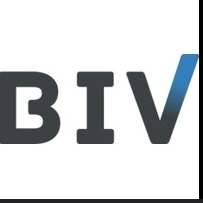
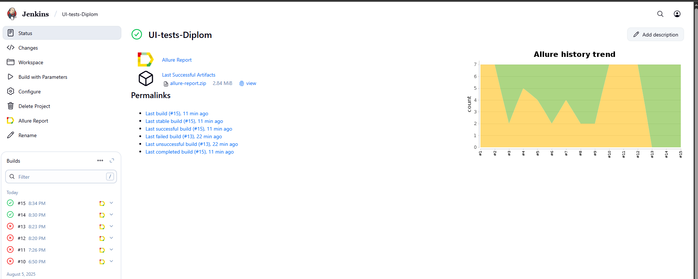
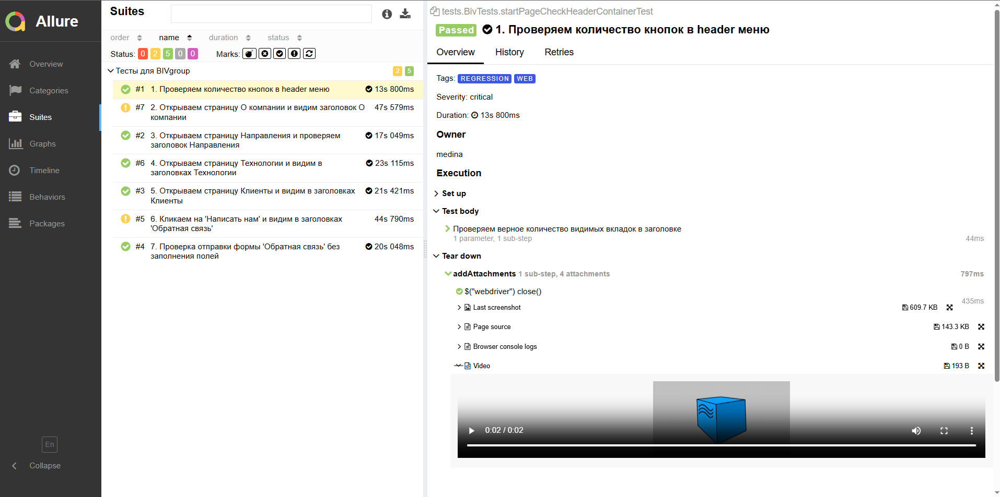
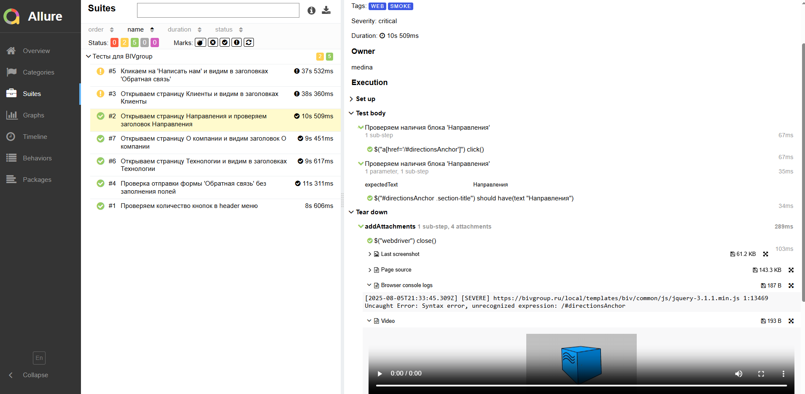
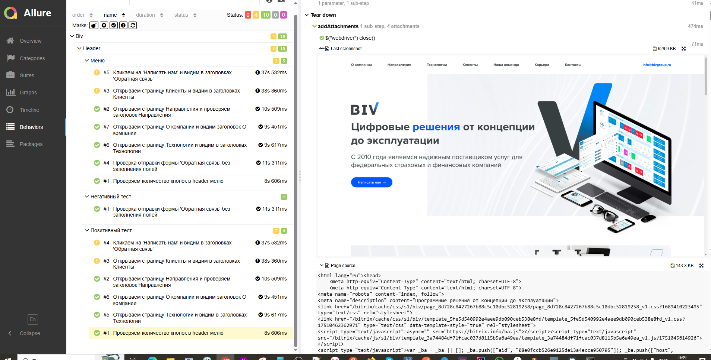
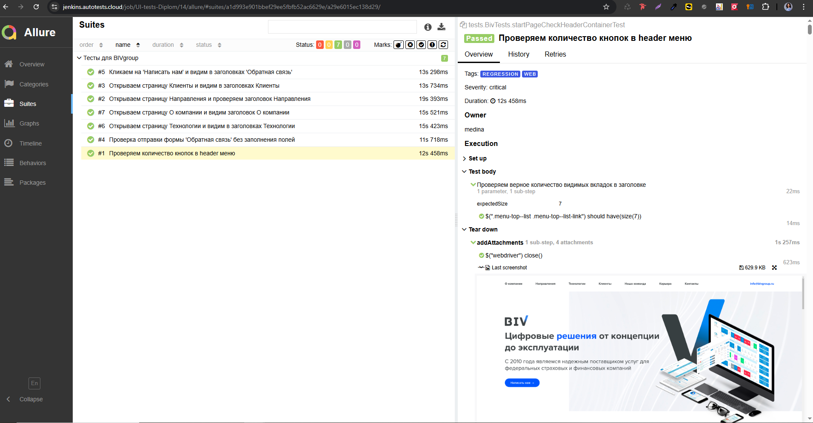
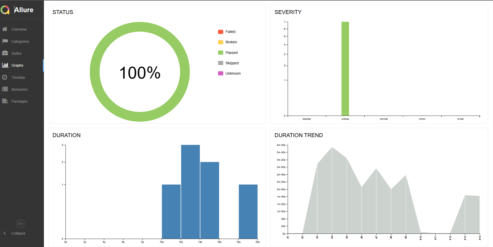
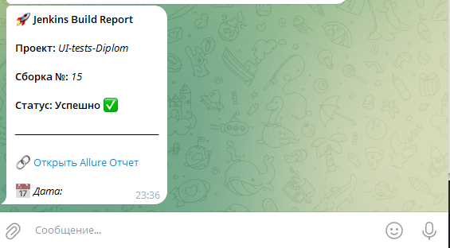
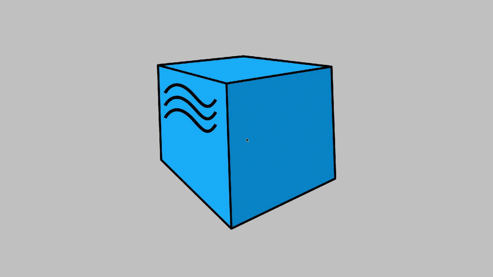
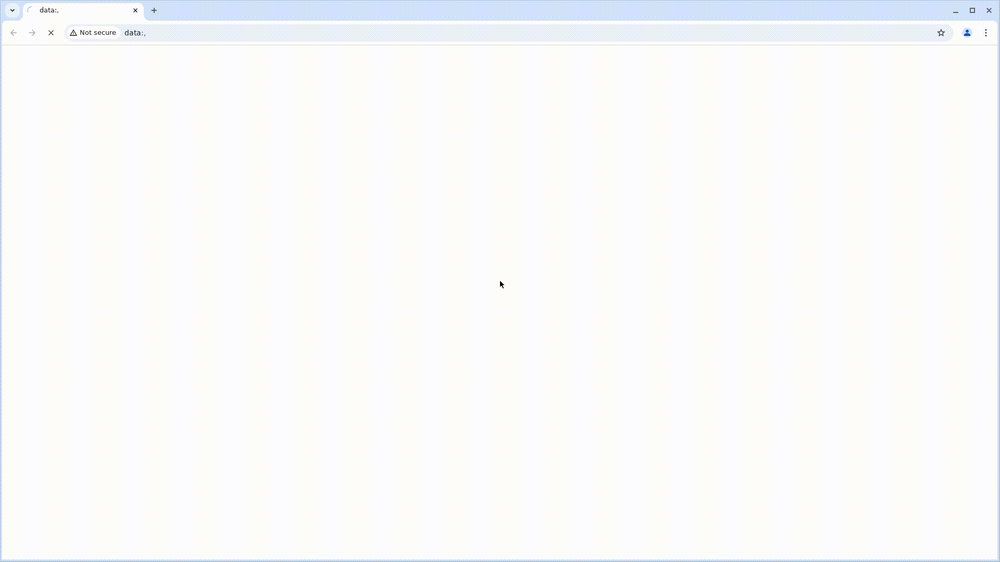

<a href="https://bivgroup.ru/ ">  
<h1 >Проект по автоматизации тестирования для компании <a href="https://bivgroup.ru/ "> BIV </a></h1> 

## ☑️ Содержание:

- [Технологический стек](#-технологический-стек)
- [Web-тесты](#-web-тесты)
- [Запуск тестов в Jenkins](#-запуск-тестов-в-jenkins)
- [Allure-отчет](#-allure-отчет)
- [Уведомления в Telegram](#-уведомления-в-telegram)
- [Видео с запуском тестов в Selenoid](#-видео-с-запуском-тестов-в-selenoid)


<a id="tools"></a>
## 💻 Технологии и инструменты:

<div align="center">
  <table>
    <tr>
      <!-- Первая строка -->
      <td align="center" width="110">
        <a href="https://www.jetbrains.com/idea/" target="_blank">
          
        </a>
        <br>IDEA
      </td>
      <td align="center" width="110">
        <a href="https://www.java.com" target="_blank">
          
        </a>
        <br>Java
      </td>
      <td align="center" width="110">
        <a href="https://junit.org/junit5/" target="_blank">
          
        </a>
        <br>JUnit 5
      </td>
      <td align="center" width="110">
        <a href="https://gradle.org/" target="_blank">
          
        </a>
        <br>Gradle
      </td>
    </tr>
    <tr>
      <!-- Вторая строка -->
      <td align="center" width="110">
        <a href="https://docs.qameta.io/allure/" target="_blank">
          
        </a>
        <br>Allure
      </td>
      <td align="center" width="110">
        <a href="https://www.jenkins.io/" target="_blank">
          
        </a>
        <br>Jenkins
      </td>
      <td align="center" width="110">
        <a href="https://github.com/" target="_blank">
          
        </a>
        <br>GitHub
      </td>
      <td align="center" width="110">
        <a href="https://rest-assured.io/" target="_blank">
          
        </a>
        <br>Rest-Assured
      </td>
    </tr>
  </table>
</div>

- Тесты написаны на **Java** с использованием фреймворка **Selenide** в **IntelliJ IDEA**
- Сборка проекта осуществляется через **Gradle**
- Запуск тестов в контейнерах **Selenoid**
- Интеграция с **Jenkins** + автоматическая отправка отчетов в **Telegram**

## 🌐 Web-тесты

### Реализованные проверки:

-  ✅ Проверяем количество кнопок в header меню"
-  ✅ Открываем страницу О компании и видим заголовок "О компании"
-  ✅ Открываем страницу Направления и проверяем заголовок "Направления"
-  ✅ Открываем страницу Технологии и видим в заголовках "Технологии"
-  ✅ Открываем страницу Клиенты и видим в заголовке "Клиенты"
-  ✅ Кликаем на 'Написать нам' и видим в заголовках 'Обратная связь
-  ✅ Проверка отправки формы 'Обратная связь' без заполнения полей

## [ Запуск тестов в Jenkins](https://jenkins.autotests.cloud/job/UI-tests-Diplom/) 


<p align="center">  
</>  
</p>


### ☑️ Параметры сборки в Jenkins:

- browser (браузер, по умолчанию chrome)
- browserVersion (версия браузера, по умолчанию 127.0)
- browserSize (размер окна браузера, по умолчанию 1920x1080)


### Команда для запуска из терминала
Локальный запуск
```bash
gradle clean UseTech
```
Запуск с параметрами:
```bash  
-Dbrowser=chrome -DbrowserSize=1920x1080 -DbrowserVersion=128.0
```
Удаленный запуск через Jenkins:
```bash  
clean UseTech
-Dbrowser="${BROWSER}"
-DbrowserSize="${BROWSER_SIZE}"
-DbrowserVersion="${BROWSER_VERSION}"
-DbrowserRemote="https://log:pass@${BROWSER_REMOTE}/wd/hub"
```

## [ Allure-отчет](https://jenkins.autotests.cloud/job/UI-tests-Diplom/4/allure/)


### ☑️ Главная страница Allure-отчета

<p align="center">  
  
</p> 
<p align="center">  
  
</p>
<p align="center">  
  
</p>
<p align="center">  
  
</p>
### ☑️ График
<p align="center">  
  
</p>

____
###  Allure Уведомление в Telegram при помощи бота
____
<p align="center">  
  
</p>

### После завершения сборки, бот, созданный в Telegram, автоматически обрабатывает и отправляет сообщение с результатом

____
##  Selenoid

###  ☑️ Примеры видео выполнения тестов на Selenoid
____
<p align="center">
  
</p>

<p align="center">
  
</p>