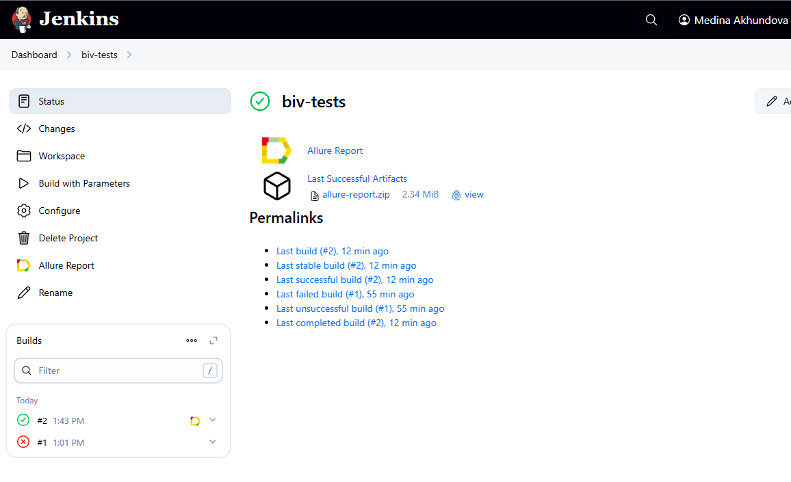
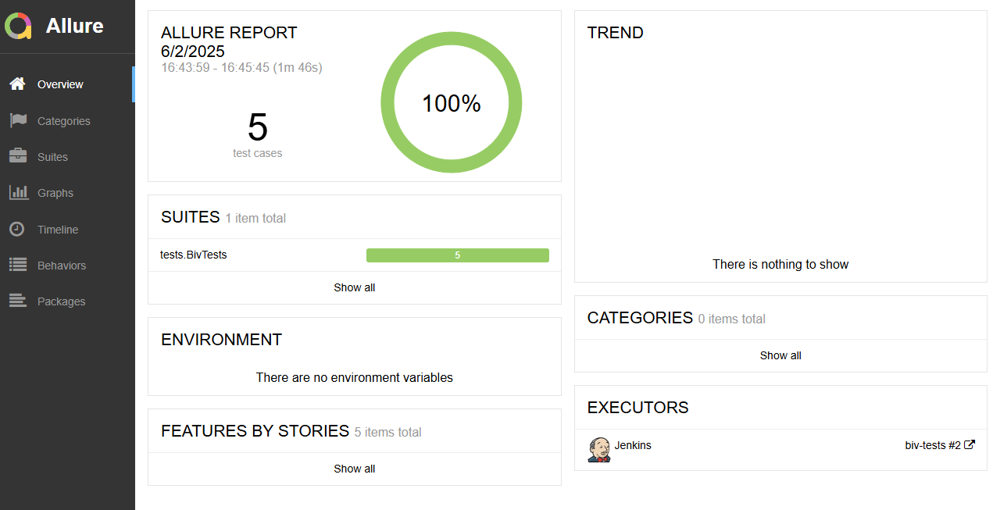
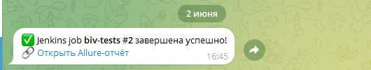

<a href="https://bivgroup.ru/ ">  
<h1 >Проект по автоматизации тестирования для компании <a href="https://bivgroup.ru/ "> BIV </a></h1> 

## ☑️ Содержание:

- Технологии и инструменты
- Список проверок, реализованных в тестах
- Запуск тестов (сборка в Jenkins) и из терминала
- Allure-отчет
- Уведомление в Telegram о результатах прогона тестов
- Видео пример прохождения тестов

<a id="tools"></a>
## ☑️ Технологии и инструменты:

<p align="center">

 
 


</p>


## ☑️ Реализованные проверки:

- Проверяем количество кнопок в header меню"
- Открываем страницу О компании и видим заголовок "О компании"
- Открываем страницу Направления и проверяем заголовок "Направления"
- Открываем страницу Технологии и видим в заголовках "Технологии"
- Открываем страницу Клиенты и видим в заголовках "Клиенты"

## ☑️ Jenkins Сборка в [Jenkins](https://jenkins.autotests.cloud/job/biv-tests/)


<p align="center">  
</>  
</p>


## ☑️ Параметры сборки в Jenkins:

- browser (браузер, по умолчанию chrome)
- browserVersion (версия браузера, по умолчанию 127.0)
- browserSize (размер окна браузера, по умолчанию 1920x1080)


## Команда для запуска из терминала
Локальный запуск
```bash
gradle clean UseTech
```
Запуск с параметрами:
```bash  
-Dbrowser=chrome -DbrowserSize=1920x1080 -DbrowserVersion=128.0
```
Удаленный запуск через Jenkins:
```bash  
clean UseTech
-Dbrowser="${BROWSER}"
-DbrowserSize="${BROWSER_SIZE}"
-DbrowserVersion="${BROWSER_VERSION}"
-DbrowserRemote="https://log:pass@${BROWSER_REMOTE}/wd/hub"
```

## ☑️ Allure Report	


## ☑️ Основная страница отчёта

<p align="center">  
  
</p>  

____
## ☑️ Allure Уведомление в Telegram при помощи бота
____
<p align="center">  
  
</p>

____
## ☑️ Selenoid

Примеры видео выполнения тестов на Selenoid
____
<p align="center">
  
</p>

<p align="center">
  
</p>